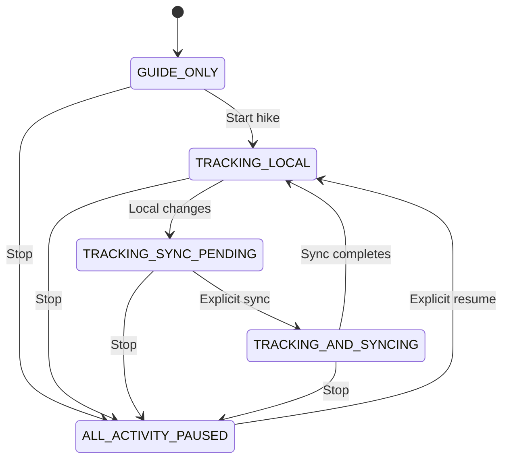

# Activity State Machine

Stop aborts registered requests, blocks new network work, pauses tracking, disables sync/uploads/background activity, records `pausedAt`, and persists `ALL_ACTIVITY_PAUSED`. Any active state restored after process restart is converted to paused. Reconnection, charging, and app launch never resume activity.
