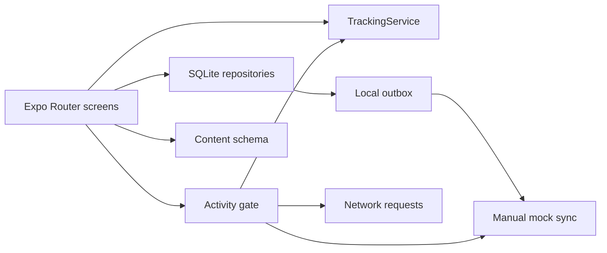

# Architecture

The Expo Router UI depends on interfaces and repositories rather than owning durable data. SQLite is the system of record for user data and settings. Bundled JSON is validated by Zod.

All network-capable paths must call the global gate. The guide has no authentication dependency. Foreground Expo Location and deterministic mock tracking implement the same contract. Background tracking remains a disabled feature flag.
