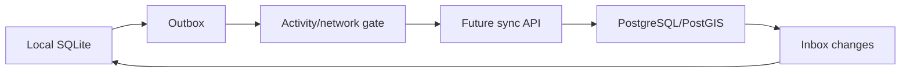

# Cloud and Authentication Roadmap

The app currently uses `LocalSessionProvider`; `DisabledCloudSessionProvider` preserves the boundary without a login wall.

Future options include Apple, Google, passkeys, or email magic links through OAuth 2.0/OpenID Connect. Account deletion, credential revocation, export, and device-to-device restore are required before launch.

A possible backend is Supabase with PostgreSQL/PostGIS, row-level security, object storage, and a versioned idempotent sync API. It is an evaluation target, not a runtime dependency.

