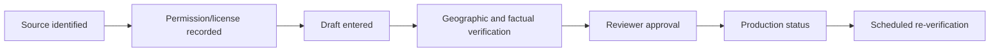

# Content Provenance

Every future real content item must record author/source, permission or license, date obtained, last verified date, verification method, geographic scope, source classification, uncertainty, and reviewer.

Schema validation rejects production-status content missing citation, verification date, or reviewer. Phase 1 content is fictional and labeled demo. Do not scrape or reproduce association guidebooks or web content.
